### Starting a Mentoring Session 

The BigBlueButton application helps mentors to conduct mentoring sessions.

> [!NOTE] Mentors can start the session only 10 minutes before the scheduled time.
 

1.  Go to  and tap **Created by Me**.

2.  To start your session, do any one of the following actions:
* Find the session and tap **Start**. 

  

* Select the session and tap **Start**.

  

#### *Setting up BigBlueButton Meeting*

BigBlueButton window opens up in your web browser.

1.  To select audio settings, do any one of the following actions:

* To connect your audio, tap **Microphone** and select **Yes**. 

  > [!NOTE] Microphone may be on initially.

  

* To join without connecting your audio, tap **Listen Only**.

  

2. To change your audio settings later, do any one of the following:

* To disconnect your audio, Tap  . Tap    and tap **Listen Only**.

* To connect your audio, Tap . Tap  , tap **Microphone** and select **Yes**.

3.  To turn on the webcam, tap  and select **Start Sharing**. To turn it off, tap  and select **Stop Sharing**.

    > [!NOTE] The webcam settings window might not appear initially. 
    > To change your webcam and background settings, tap , make changes, and close the window.
    
     

    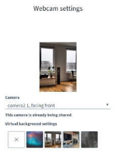 

4. To pause recording, tap the record button and tap **Yes**. Tap the record button again to resume recording.

   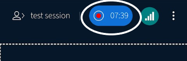

5. To set status, tap  , tap your name, and select a status.

   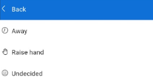

    

   > [!TIP] To view and clear participant's status, see [Managing Users on BigBlueButton](#managing-users-on-bigbluebutton)

6.	To leave the call, go to   and select **Leave Meeting** or press Back key on your phone.

    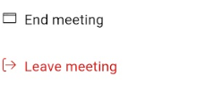

    > [!NOTE] 
    > - If you leave the call by mistake, go back to MentorED and start the session.
    > - But, if you leave the call after the scheduled end time, you cannot start the meeting.

     

7.  To end the meeting, go to  and select **End Meeting**.

> [!TIP] To learn more, See [BigBlueButton Help](https://docs.bigbluebutton.org/support/getting-help.html).

 

#### *Shared Notes* 
Shared notes allows both host and participants to take notes and share resources.

> [!NOTE]  
> * Partcipants can edit or delete information from shared notes.
> *  indicates new information shared in the Chat or Shared Notes.

 

1. To take notes, go to  and select **Shared Notes**. 

   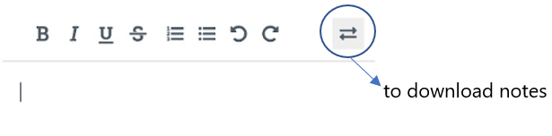

   
3. To turn off Shared Notes for participants, go to   and tap . Select **Lock Viewers**, turn off **Edit Shared Notes**, and tap **Apply**.

   > [!TIP] 
To allow only selected participants to use the shared notes, turn off shared notes. Go to , tap the user, and select unlock.

 

> [!TIP] To learn more, See [BigBlueButton Help](https://docs.bigbluebutton.org/support/getting-help.html).

 

#### *Chat*
Users can chat with others privately or share queries and information on the Public Chat.

1. To chat with participants, go to  and select **Public Chat**. 

2. To chat with participants privately, go to , tap the user, and select **Start a Private Chat**. 

3. To turn off Chat for participants, go to  and tap . Select **Lock Viewers**, turn off features and tap **Apply**.

   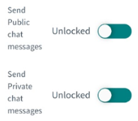

   > [!TIP] 
To allow only selected participants to use the chat, turn off chat. Go to , tap the user, and select unlock.

 

> [!TIP] To learn more, See [BigBlueButton Help](https://docs.bigbluebutton.org/support/getting-help.html).

 
      

#### *Managing Users on BigBlueButton*
The Host can allow participants to be the Moderator or Presenter.

> [!NOTE] The meeting host is a moderator and presenter.

1. To view users, go to .

2. To make the user a moderator,  tap the user and select **Promote to Moderator**. 

   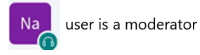

   > [!NOTE] 
   > * Moderators can manage users and [end meeting](#starting-a-mentoring-session). 
   > * Moderators can be more than one.

    

3. To change moderator back to a participant, tap the user and select **Demote to Viewer**.

   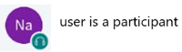

4. To make the user a presenter, go to profile icon, tap the user, and select **Make Presenter**.

   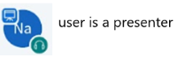

   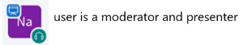

   > [!NOTE] 
   > * Presenter can [present files](#presenting-a-file), [start a poll](#starting-a-poll), [select a random user](#selecting-a-random-user), and use [whiteboard](#whiteboard). 
   > * Only one user can be a presenter.

    

4. To change presenter back to a participant, tap your name and select **Take Presenter**.

5. To change user settings, go to  and tap . The user settings include:

* Mute All Users: to mute all users
* Mute All Users Except Presenter: to mute only participants
* Lock Viewers: to restrict participant's access to meeting features
* Guest Policy: to restrict or deny participants from joining the call
* Save User Names: to download user list
* Clear All Status Icons: to clear user status
* [Create Breakout Rooms](#creating-breakout-rooms): to divide participants into groups 
* Write Closed Captions: to turn on captions
* Learning Analytics Dashboard: to open a dowloadable file that includes session duration and user activity.

6. To change settings for selected users, go to  and tap the user's name. The user settings include:

* Mute User: to mute a user
* Clear Status: to clear user status
* [Give Whiteboard Access](#whiteboard): to allow a user to use the whiteboard
* Remove User: to remove a user from the session

> [!TIP] To learn more, See [BigBlueButton Help](https://docs.bigbluebutton.org/support/getting-help.html).

 

#### *Meeting settings*
Users can change the meeting window layout and turn off notifications.

1. Tap  and select **Settings**. 

2. To change meeting layout, tap the **Application** tab, select **Layout Type**, and tap **Save**.

   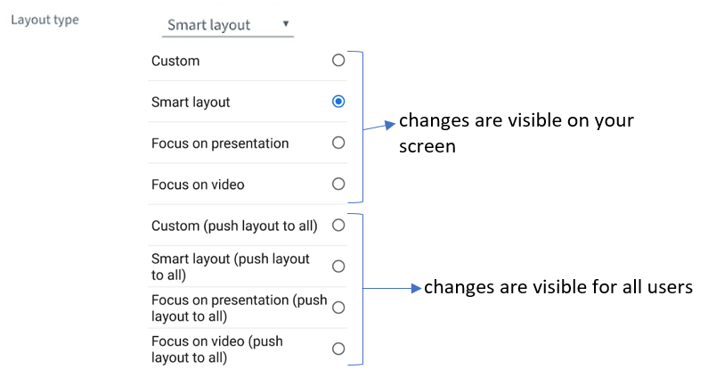

3.  To turn off audio and popup alerts, tap the **Notifications** tab, turn off notifications, and tap **Save**.

    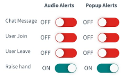

4. To save your bandwidth, tap the **Data Savings** tab, turn off options, and tap **Save**.

   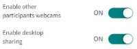

> [!TIP] To learn more, See [BigBlueButton Help](https://docs.bigbluebutton.org/support/getting-help.html).

 

#### *Presenting a File*

Users can upload and present files (images, documents, and files) during the session.

1.  To upload a file, tap .

2.  Select **Manage Presentations** and select an upload option.

    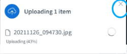

    

3.  Select the photo or document and tap **Upload**.
    
    > [!TIP] To stop the uploading the file, close the upload status window.

    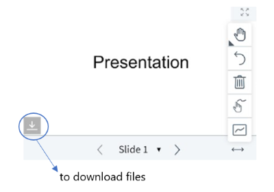

4. To manage uploaded files, tap  and select **Manage Presentations** . Tap **Confirm** after making changes.

   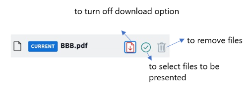

   > [!TIP] To change displayed files, you can also tap  and select files.
    

5. Tap  to hide the presentation and tap  to show the presentation.

   > [!NOTE] The changes are visible only on your screen. 
    

6. To share a video, tap  and select **Share External Video**. Paste the video URL and tap **Share a New Video**.

   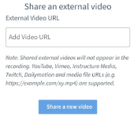

7. To stop presenting video, tap  and select **Stop Sharing External Video**.
   

> [!TIP] To learn more, See [BigBlueButton Help](https://docs.bigbluebutton.org/support/getting-help.html).

 

#### *Whiteboard*

Users can add shapes and text to the presentation.

> [!NOTE] The whiteboard appears only after presenting a file.

 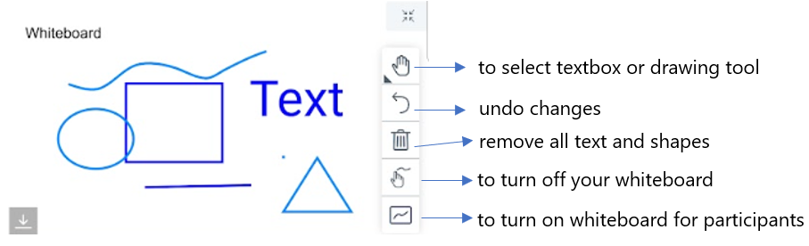

To turn on the Whiteboard for selected users, go to  and tap the user's name. Select **Give Whiteboard access**.

 

> [!TIP] To learn more, See [BigBlueButton Help](https://docs.bigbluebutton.org/support/getting-help.html).

 

#### *Starting a Poll*
Poll allows users to select answers to a question.

> [!NOTE] You can start a poll only after presenting a file.

1. To start a poll, tap  and select **Start a Poll**.

2. Select a response type and tap **Start Poll**.

   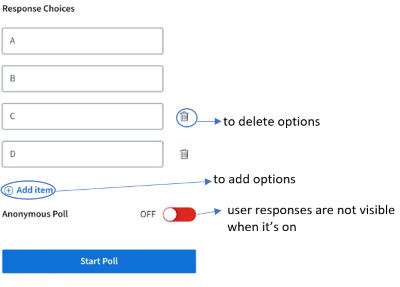

   > [!TIP] To allow users to type answers, select **User Response**. 

3.  To present the poll results, tap **Publish Poll**.
    
     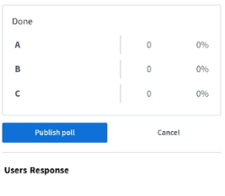 

     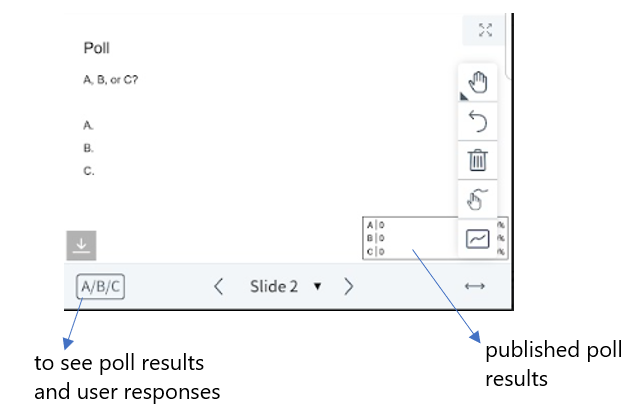

> [!TIP] To learn more, See [BigBlueButton Help](https://docs.bigbluebutton.org/support/getting-help.html).

 

#### *Selecting a Random User*
The host can select a particpant to answer a question.

To select a random user, tap  and tap **Select Random User**.

> [!TIP] To learn more, See [BigBlueButton Help](https://docs.bigbluebutton.org/support/getting-help.html).

 

#### *Creating Breakout Rooms* 

The host can divide particpants into groups.

1. Go to  and tap .

2. Select **Create Breakout Rooms**.

3. Select the number of rooms and duration. Tap **Next**. 

   > [!TIP] If you select <b>Allow Users to Choose a Breakout Room to Join</b>, tap <b>Create</b> to create breakout rooms.

    

   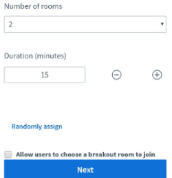

4. Add particpants to breakout rooms and tap **Create**.

   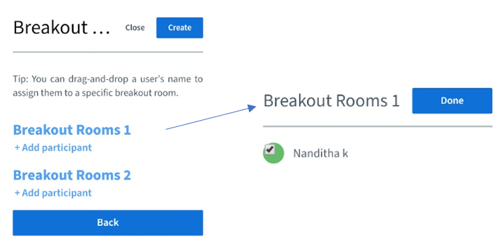

3. To join a breakout room, go to  and tap **Breakout Rooms**. Select a room and tap **Ask to Join**.

   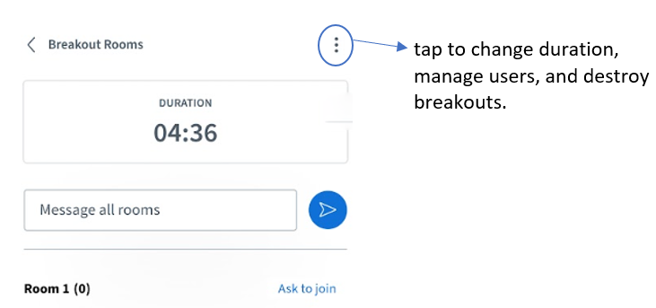

   > [!TIPS] 
   > * The breakout room opens up in a new tab. You can switch between tabs or meeting windows. 
   > * To leave the Breakout Room, close the Breakout Room tab.

    

> [!TIP] To learn more, See [BigBlueButton Help](https://docs.bigbluebutton.org/support/getting-help.html).

 

