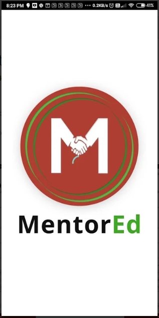

# Using the MentorED Mobile Application

> MentorED is an open source mentoring application that facilitates peer
learning and professional development by creating a community of school
leaders, teachers, educational officers, and cluster and state resource
groups.

## Overview

The following table summarizes the two types of users who can make use of the MentorEd platform.

| Mentors | Mentees |
| ----------- | ----------- |
| Create and manage live mentoring sessions| Discover and join live mentoring sessions |
| Interact with the participants on a one-on-one basis | Interact with the mentor and other participants on a one-on-one basis|
| Collaborate with other mentors on mentoring sessions | Collaborate with other participants |
| Use the mentor directory to connect with other mentors | Use the mentor directory Get to know more about mentors|
|provide feedback on mentoring sessions| provide feedback on mentoring sessions|

This user guide contains instructions regarding MentorEd functions and
provides users a seamless experience.

## MentorED Mobile Application for Mentors

### Signing up 

First-time users should create an account on MentorED.

1.  Install the MentorED application from Google Play or App Store.

2.  Open MentorED and select **Sign up**. 

3.  Select **Mentor** and tap **Continue**.

4.  Enter your Name, Email Id, Password, and the Secret Code.

> [!NOTE] 
>  Enter the correct Email id. 
 

5. Tap on **Sign up as Mentor**.

6.  Enter the OTP sent to your email and tap **Verify and Login**. 
> [!TIP] To receive a new OTP, tap **Resend OTP** or **If You Didn’t Receive the OTP!**.

7.  Select **Agree to Terms of Use** and tap **Proceed**.
You are now logged in to your homepage.

8.  To log out, go to and tap **Logout**.

### Logging in

Signed-up users can log in to access their homepage.

1.  Open MentorED and select **Login**.

2.  Enter your Email Id and Password and tap **Login**. 

> [!NOTE]
> Enter the correct email id and password to access your homepage. Passwords are case-sensitive.
 

> [!TIP]
> If you do not remember your password, select **Forgot Password** to change your password.
 

### Creating and Managing Your Profile

Create a profile to help your mentees get to know you.

You cannot use the application without creating your profile. 

1.  Go to **Profile** and tap **Edit**.

2.  Enter your details.

3.  If you want to add a profile picture, tap **Add Image** and select either of the two options.

4.  Tap **Submit**.

### Mentor Directory

You can find a list of mentor profiles arranged in alphabetical order in the mentor directory.

To view the mentor profile, do any one of the following actions:

* In the Search Bar of the Homepage, select the Mentor Profile tab. Type the mentor’s name, tap Search, and select the mentor profile tile.

* Go to Mentors. Find a mentor and tap the mentor profile tile.

### Setting up a MentorEd Session

Mentors can create and manage mentoring sessions.

1.  Go to **Sessions** and select **Created by Me**.

2.  Select **+ Create New Session**.

3.  Enter the session details.

4.  Tap **Add Image** if you want to add a profile picture.

5.  Tap Publish.

6.  To edit or delete a session, tap the session tile and tap **Edit** or **Delete**. 

### Inviting Mentors and Mentees

To share a session link to your contacts or on social media, tap the
session tile and tap .

### Starting a Mentoring Session 

The BigBlueButton application helps mentors to conduct mentoring sessions.

Mentors can start the session only 10 minutes before the scheduled time.

1.  Go to **Sessions** and tap **Created by Me**.

2.  Find the session and tap **Start**. 

> [!NOTE]
> If you have not yet set a default browser, select one.
 

BigBlueButton window opens up in your default web browser.

3.  To connect your audio, tap **Microphone** and tap **Yes**. 

The BigBlueButton meeting screen appears.

4.  To turn on the camera, tap and tap **Start Sharing**. To turn it off, tap and tap **Stop Sharing**.

5.  To check the number of participants, tap  and view **Users**. 

6.  To chat with the participants, tap and select **Public Chat**.

7.  To end the meeting, go to and select **End Meeting**.

### Presenting a File

Mentors can upload and present documents and photos during the session.

1.  To upload a file, tap + .

2.  Select **Manage Presentations** and select an upload option.

3.  Select the photo or document and tap **Done**.

4.  Tap to present the uploaded photo or document.

### Enrolling for a MentorEd Session

Mentors can sign up for mentoring sessions.

1.  On your homepage, find a session of interest. Tap the session tile and tap **Enroll**.

2.  To cancel your enrollment, tap **Cancel**. 

### Joining a MentorEd Session

Participants can attend the mentoring session using the BigBlueButton application.

Participants can only join 15 minutes before the scheduled time.

1.  On your **Homepage**, select the session and tap **Join**. 

> [!NOTE]
> If you have not yet set a default browser, select one.
 

BigBlueButton window opens up in your default web browser.

> [!TIP]
> If you see an error, go back to MentorEd and tap **Join**.
 

2.  To connect your audio, tap **Microphone** and tap **Yes**. The BigBlueButton meeting screen appears.

3.  To turn on the camera, tap and tap **Start Sharing**. To turn it off, tap and tap **Stop Sharing**.

4.  To chat with the participants, tap and select **Public Chat**.

5.  To take notes, tap and select **Shared Notes**. A notepad appears.

6.  To download your notes, tap and select the file format.

7.  To leave the meeting, go to and select **Leave Meeting**.

**Best Practices**

-   Unmute your microphone only when necessary.

-   Maintain a neat background and attire before your turn on your webcam. 

> [!COMMENT]
> Should the webcam be turned on throughout the session?
 

-   Use respectful language while sharing any information on the chat
    > box. Discuss only mentoring-related topics.

### Joining a MentorEd Session Using a Shared Link

### Dashboard

1.  Go to **Dashboard**.

2.  Select the Mentor tab to view your activity insights such as total sessions created and hosted. 

### Review Feedback from Mentees

Mentors can view their session feedback 24 hours after the session on
the notification page.

## MentorED Mobile Application for Mentees

### Signing up 

First-time users should create an account on MentorED.

1.  Install the MentorED application from Google Play or App Store.

2.  Open MentorED and select **Sign up**. 

3.  Select **Mentee** and tap **Continue**.

4.  Enter your Name, Email Id, and Password.

> [!NOTE] Enter the correct email id.
 

5.  Tap on **Sign up as Mentee**.

6.   Enter the OTP sent to your email and tap **Verify and Login**. 

> [!TIP] To receive a new OTP, tap **Resend OTP** or **If You Didn’t Receive the OTP!**.   

7.  Select **Agree to Terms of Use** and tap **Proceed**. You are now logged in to your homepage.

8.  To log out, go to and tap **Logout**.

### Logging in

Signed-up users can log in to access their homepage.

1.  Open MentorED and select **Login**.

2.  Enter your Email Id and Password and tap **Login**.

> [!NOTE]
> Enter the correct email id and password to access your homepage. Passwords are case-sensitive.
 

> [!TIP]
> If you do not remember your password, select **Forgot Password** to change your password.
 

### Creating and Editing a Profile

Create a profile to help your mentees get to know you.

You cannot use the application without creating your profile. 

1.  Go to **Profile** and tap **Edit**.

2.  Enter your details.

3.  If you want to add a profile picture, tap **Add Image** and select the image that you want to use.

4.  Tap **Submit**. To make further edits to your profile, repeat the same.

### Mentor Directory 

You can find a list of mentor profiles arranged in alphabetical order in the mentor directory.

To view the mentor profile, do any one of the following actions:

*  In the Search Bar of the Homepage, select the Mentor Profile tab. Type the mentor’s name, tap Search, and select the mentor profile tile.

* Go to Mentors. Find a mentor and tap the mentor profile tile.

### Enrolling for a MentorEd Session

Mentees can sign up for mentoring sessions.

1.  On your homepage, find a session of interest. Tap the session tile and tap **Enroll**.

2.  To cancel your enrollment, tap **Cancel**. 
   

### Inviting Mentors and Mentees

To share a session link to your contacts or on social media, tap the session tile and tap .

### Joining a MentorEd Session

Participants can attend the mentoring session using the BigBlueButton application.

Participants can only join 15 minutes before the scheduled time.

1.  On your **Homepage**, select the session and tap **Join**. If you have not yet configured a default browser select one. BigBlueButton window opens up in your default web browser.

> [!TIP]
>  If you see an error, go back to MentorEd and tap **Join**.
 

2.  To connect your audio, tap **Microphone** and tap **Yes**. The BigBlueButton meeting screen appears.

3.  To turn on the camera, tap and tap **Start Sharing**. To turn it off, tap and tap **Stop Sharing**.

4.  To chat with the participants, tap and select **Public Chat**.

5.  To take notes, tap and select **Shared Notes**. A notepad appears.

6.  To download your notes, tap and select the file format.

7.  To leave the meeting, go to and select **Leave Meeting**.

**Best Practices**

-   Unmute your microphone only when necessary.

-   Maintain a neat background and attire before your turn on your webcam.
     
>[!COMMENT|style:flat]
> Should webcam be turned on throughout the session?
 

-   Use respectful language while sharing any information on the chat box. Discuss only mentoring-related topics.

### Joining a MentorEd Session Using a Shared Link

### Dashboard

1.  Go to **Dashboard**.

2.  Select the Mentor tab to view your activity insights such as total sessions enrolled and attended. 

### Providing Feedback for a Session

Mentees can provide their feedback on the following fields:

-   Rate your mentor 

-   Rating the content 

-   Audio / Video Quality

>[!Note|style:flat]
>Testing
 

>[!TIP|style:flat]
>Test
 

>[!Attention|style:flat]
>Test
 

>[!WARNING|style:flat]
>Test
 

>[!COMMENT|style:flat]
>Test
 
