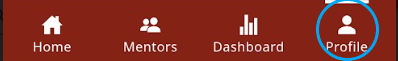
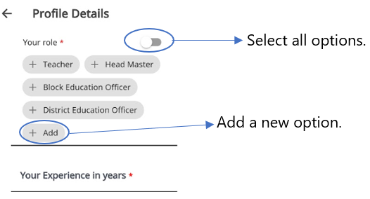

# Creating and Managing a Profile

Users can update their profile details. Mentor profiles are saved in the [Mentor Directory](mentor-directory.md).

> :::note
> You cannot use the application without updating your profile. 

1.  Go to **Profile** and tap **Edit**.

    

    

    

2.  Enter your details.

    

    

    

3.  If you want to add a profile picture, tap **Add Image** and select **Take Photo** or **Choose from Library**.

4.  Tap **Submit**. To make further edits to your profile, repeat the same.