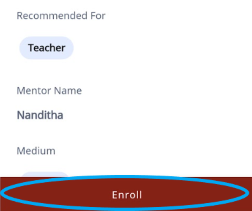
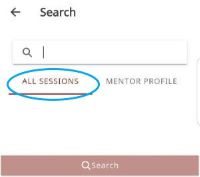
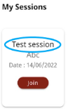
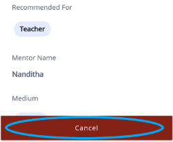

# Enrolling for a MentorED Session

Users can sign up for mentoring sessions.

1.	To enroll for a session, do any one of the following actions:

* On your Homepage, find a session of interest. Tap the session tile and tap **Enroll**.

   

  

* In the search bar, select **All Sessions** tab, type the session name, and tap **Search**. Tap the session tile and tap **Enroll**.

  

2.  To cancel your enrollment, tap **Cancel**. You can also go to **My Sessions** on your Homepage  , tap the session, and tap **Cancel**.

    > [!NOTE] You cannot cancel the session 10 minutes before the scheduled time.

    

    
