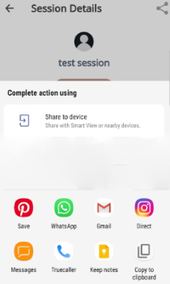

# Inviting Mentors and Mentees
You can invite more participants to a session by sharing a session link.

1. To share a session link, do any one of the following actions:

* On your Homepage, go to **All Sessions**, select an upcoming session, and tap .

   

   

   

* On your Homepage, go to **My Sessions**, select an enrolled session, and tap .

2. Share the session link with your contacts or on social media.
